<p align="center">
  <picture>
    <source media="(prefers-color-scheme: dark)" srcset="docs/assets/brand/maestro_lockup_dark.svg">
    
  </picture>
</p>

<p align="center">
  <a href="https://github.com/seinun-ai/maestro-career-studio/actions/workflows/ci.yml"></a>
  <a href="https://github.com/seinun-ai/maestro-career-studio/actions/workflows/codeql.yml"></a>
  <a href="https://github.com/seinun-ai/maestro-career-studio/actions/workflows/ci.yml"></a>
  <a href="LICENSE"></a>
  <a href="https://maestrocareerstudio.com"></a>
</p>
<!-- TODO(P5): after the first v* tag publishes images, add a ghcr.io image badge here,
     e.g. https://img.shields.io/badge/ghcr.io-multi--arch-blue linking to the packages page.
     Also refresh the static test-count badge above at each release. -->

**A job-application studio that runs entirely on your machine — and shows you
a diff of every change the AI makes.**

Most resume checkers score the same resume differently every run, because they
ask an LLM to guess. Maestro's ATS engine is deterministic and LLM-free: same
resume, same job, same score, every time. Tailoring composes from a **Career
Knowledge Base** of things you actually did — approved evidence lands verbatim,
every AI edit is a reviewable, revertible diff, and the output is a real
**LaTeX** or **Typst** PDF compiled locally.

<!-- P4 hero.gif — CLEARED for publish 2026-08-20. Recorded on the mock instance:
     contact header scrubbed (ajey@seinun.com, placeholder phone), lift
     49.2 -> 70.8 is a real deterministic score. Two items reviewed and
     accepted by the owner rather than fixed: the real Visa posting stays (an
     employer-published public document), and the "Liberty Hill, TX" experience
     location stays (already the contact city on the public resume).
     1000px / 10fps / 64 colors, 1.8 MB; re-encode any replacement to match. -->

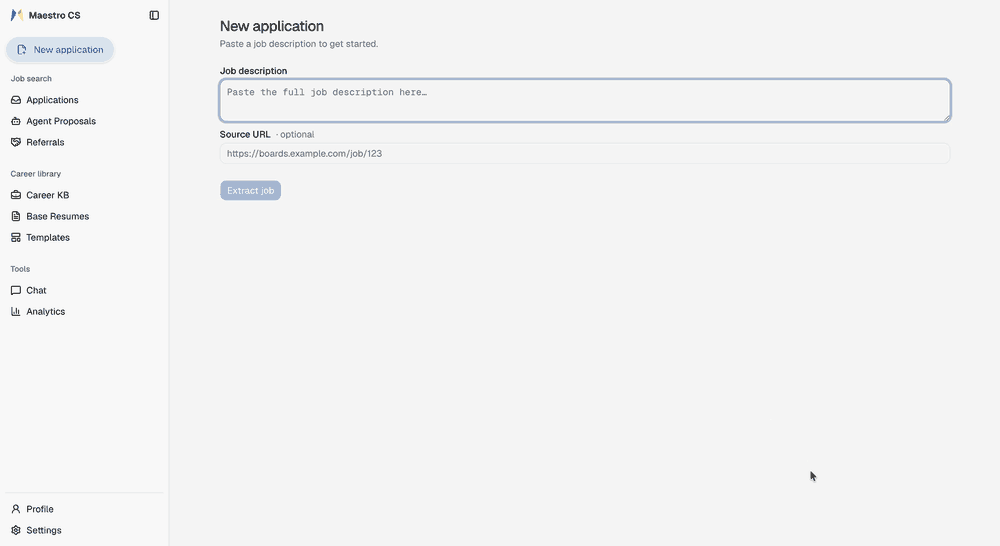

**83 MCP tools** to drive it from Claude, Codex, or the ChatGPT desktop app ·
**bring your own model** — OpenAI, Gemini, or any OpenAI-compatible
endpoint; the deterministic core (scoring, rendering, tracking)
never calls one · **localhost-only, nothing phones home** · **leaves with
you** — your whole record exports to one `career.md`

> **Single-user and local-first by design.** No login, no tenancy, no server
> holding your career history — every port binds to `127.0.0.1`, and even the
> browser extension's telemetry posts only to your own local backend (its
> schema records zero form-field values). One rule follows: **never expose it
> to a network.** [`SECURITY.md`](SECURITY.md) has the threat model.

**Contents:** [Why Maestro CS?](#why-maestro-cs) ·
[Prerequisites](#prerequisites) · [Quickstart](#quickstart) ·
[Using it well](#using-it-well) ·
[Driving it from Claude, Codex, or ChatGPT (MCP)](#driving-it-from-claude-codex-or-chatgpt-mcp) ·
[The rest of the toolkit](#the-rest-of-the-toolkit) ·
[Execution modes](#execution-modes--docker-compose-stack) ·
[Directory layout](#project--runtime-directory-layout) ·
[Community & contributing](#community-documentation--contributing) ·
[Licensing](#licensing) ·
[Troubleshooting](#troubleshooting--common-questions)

It covers the whole loop — build the career record, target it at a role,
capture the job, tailor, render, apply, track — across three surfaces that
share one backend: a web app, a companion browser extension, and an **MCP
server** so the assistant you already use can drive any of it.

---

## Why Maestro CS?

**Your time belongs in your career, not in the paperwork around it.** Most of a
job search goes into artifacts that are thrown away a week later: a resume
rebuilt from scratch for each role, a cover letter written again from memory,
the same "tell us about a time you…" answered for the fourth time. None of that
effort compounds. The premise here is that it should — you record what you
actually did once, and every document after that is assembled from that record.

**One career, one source of truth, all the way to the PDF.** Your work goes into
a structured **Career KB** once; base resumes compose from *approved* KB points;
applications tailor from those; templates are only a presentation layer over the
same structured data. Approved evidence composes **verbatim** — nothing is
invented at create time, and rewriting a bullet is a separate, explicit step that
asks you first.

**So the document never drifts away from you.** Ask a general-purpose assistant
for a tailored resume and you get fluent text that no longer quite matches what
you did, in a layout it reinvents each time, with nothing kept between
conversations. Here the tailoring is anchored: a **gap** names a job requirement
your resume does not evidence, and closing one either surfaces something true you
had not written down yet — which then belongs to you permanently — or it stays a
gap. Every edit records a **resume version**, so nothing is lost and nothing is
one-way.

**The typesetting is yours — without the typesetting headache.** Real LaTeX and
Typst templates, compiled on your machine. You edit *content* in a structured
editor — a bullet is a bullet, never a paragraph you re-indent or a `.tex` line
you hand-patch — and the layout stays the template's job, so changing a word is
easier than in a Word doc and can never break the formatting. A template owns
presentation and nothing else, so switching one never touches your content — and
you can adapt a design you found or write your own, instead of accepting
whatever shape a model felt like producing today.

**Nothing here is rented.** Apache 2.0 (see [Licensing](#licensing)), runs locally,
no account, no subscription, no usage tier. The Career KB exports to a single
`career.md` you can read, diff and take anywhere. Point it at your own choice
of models and everything keeps working. Tooling for someone's
career should be infrastructure, not a rental.

That whole cycle — evidence → base resume → application → typeset PDF — is the
part other tools cannot reproduce. A resume builder gives you the last step with
no evidence base behind it; a matcher scores a document it did not compose. Here
the document and the evidence stay connected end to end.

### How it compares

Only checkable claims — verify any row yourself (columns describe the
categories as of August 2026; tell us if a row has gone stale):

| | Typical AI resume builders | CLI skill frameworks (e.g. career-ops) | **Maestro CS** |
|---|---|---|---|
| ATS scoring | LLM or black-box — same input, different score per run | LLM judgment | **Deterministic & LLM-free** — same input, same score, always |
| Measured tailoring lift | Static score only | Not scored as a lift | **Base → tailored delta, per application** |
| See what the AI changed | No audit trail | No | **Per-hunk diff, revertible** |
| Typeset output | House web templates | HTML → PDF | **Real LaTeX and Typst, bring your own template** |
| Career record | None (per-document) | Flat markdown/YAML files | **Structured, versioned KB — exports to one `career.md`** |
| Agent access | No | CLI skill files | **MCP server (83 tools) against your own machine** |
| Auto-submits for you | N/A | Never (stated) | **Never — consent ledger, enforced** |
| Cost | $15–75/month | Free + tokens | **Free (Apache 2.0) + your own tokens — [≈1¢ per application](#do-you-need-an-api-key)** |

### 🌟 Featured: Career KB Onboarding (Drop in your resumes, get a knowledge base)
The most powerful feature you can experience in your first ten minutes is automated Career KB consolidation. When you add multiple existing versions of your resume (as `.json` files in `base_resumes/`), on startup the app runs `seeding.seed_career_kb` to automatically consolidate *every* base resume into a unified **Career Knowledge Base**. It performs intelligent entity resolution across your diverse resumes, deduplication, bullet clustering, and profile synthesis into a single structured record of your work history, projects, and skills.
- *How it works out of the box:* Because we never ship personal data, a fresh git clone includes exactly one synthetic sample (`base_resumes/example.json`). On first run, it seeds your KB from this demonstration file. Once you add your own real resumes and clear the one-shot seeding flag, it synthesizes a comprehensive career graph across all your variants.
- *Graceful offline retry:* KB seeding requires an active LLM API key. **If no API key is configured at startup, seeding defers cleanly without failing and automatically retries on a later boot** once you add a key in Settings.

### 🛡️ 100% Deterministic ATS Scoring (No LLM in scoring)
Unlike typical AI wrappers, **scoring is deterministic and LLM-free**. A hybrid scoring engine blends deterministic lexical layers (keyword coverage, section placement, recency weights, title matches, experience gates, and format linting) with a pinned local embedding model (running offline on CPU via fastembed/ONNX) for semantic evaluation.
- **Anchored Soft-Matching:** A soft semantic match requires both an overlapping lexical anchor token and embedding proximity. This credits genuine industry synonyms and reformulations (e.g., matching "container orchestration" to Kubernetes) without hallucinating unearned skills.
- The exact same resume, job description, and versioned config produce an
  identical 0–100 score and diagnostic breakdown, run after run.
- **One input does move: recency.** Experience is weighted against *today*, so a
  document scored months apart can shift as the work in it ages. That is the
  only thing that changes — no run-to-run variance, no model in the loop.
  [`KNOWN_ISSUES.md`](KNOWN_ISSUES.md) tracks recording `as_of` alongside the
  score so a stored number says which day it belongs to.

### The trade that buys all of this: no authentication

Single-user and local-first means there is **no login, and no authentication on
any HTTP or MCP endpoint** — that absence is what removes the accounts, the
tenancy and the server holding your career history. Compose binds every port to
`127.0.0.1`, so out of the box nothing outside your machine can reach it.

**One rule follows from that: do not expose it to a network.** Not the public
internet, not your LAN, not a tunnel. Anything that can reach the API has full
read and write access to your entire career record and your saved API keys.
Running it locally is safe by construction; publishing it is not, and no setting
makes it so. [`SECURITY.md`](SECURITY.md) has the detail and the threat model.

---

## Prerequisites
- **Docker Desktop** (or Docker Engine + Compose v2)
- **~4 GB of disk space** for the three images (backend ~1.9 GB, frontend
  ~1.6 GB, PostgreSQL ~0.4 GB). The backend carries a minimal TeX Live
  (`scheme-basic` plus exactly the packages the bundled templates use, ~660 MB),
  Typst, and the pinned embedding model.
- **One API key — OpenAI or Gemini, either alone is a complete setup.** The
  parts that make Maestro CS fastest day to day run on it: in-app tailoring,
  the extension's tailor-on-the-go and AI form filling, cover letters and Q&A,
  KB consolidation, chat. An OpenAI key runs the profile a fresh install ships
  with (about a penny per application); a Gemini key runs the faster one (under
  3¢) — see [Choose your models](#5-choose-your-models-deliberately). Without
  any key you still have the deterministic core, and an MCP client can supply
  the intelligence itself — see
  [Do you need an API key?](#do-you-need-an-api-key) (Any OpenAI-compatible
  endpoint can be configured instead, including local servers — but that path
  is [untested so far](#local-model-servers-untested).)

---

## Quickstart

> **New here?** [`docs/GETTING_STARTED.md`](docs/GETTING_STARTED.md) is the
> hand-holding version of everything below — from installing Docker to your
> first tailored PDF, in the order that works, including the let-an-AI-agent-
> set-it-up shortcut.

The whole setup is **four pieces, and only the first is required** — the rest
attach to it whenever you want them:

| Piece | What it takes |
|---|---|
| **1. The stack** | one `docker compose up -d` (below) — three containers, all on localhost |
| **2. One API key** | paste into `.env` or **Settings → Models**; OpenAI *or* Gemini, [either alone is a complete setup](#5-choose-your-models-deliberately) |
| **3. MCP for your assistant** | one script — `./scripts/setup-mcp.sh` registers Claude Code and prints paste-ready config for Claude Desktop and the ChatGPT desktop app / Codex CLI ([details](#driving-it-from-claude-codex-or-chatgpt-mcp)) |
| **4. The browser extension** | `chrome://extensions` → Developer mode → **Load unpacked** → the repo's `extension/` folder. **No ID to copy, nothing to configure**: the extension pins its identity, so the backend already allowlists it out of the box — [full steps](extension/README.md) |

```bash
# 1. Clone the repository and copy the environment template
git clone https://github.com/seinun-ai/maestro-career-studio.git
cd maestro-career-studio
cp .env.example .env

# 2. Recommended: edit .env and paste an OPENAI_API_KEY (or GEMINI_API_KEY) —
#    the deterministic core runs without one, the AI lanes want one
# 3. Build and start the stack (first build takes several minutes — it installs
#    TeX Live and downloads the embedding model)
docker compose up -d --build
```

Then open **http://localhost:3000**.

> **This release builds locally.** Prebuilt multi-arch images ship from the
> first tagged release; once they are up, set `IMAGE_REGISTRY=ghcr.io/seinun-ai/maestro-career-studio`
> in `.env` and the same compose file *pulls* `amd64`/`arm64` images instead —
> `docker compose up -d`, no build step.

> **The compose path is the least-tested part of this release.** The stack runs
> daily on my machine, but the fresh-clone first boot has had little
> outside testing yet. If it fails on yours, please
> [open an issue](https://github.com/seinun-ai/maestro-career-studio/issues)
> with the log — right now that report is one of the most valuable
> contributions there is.

### Do you need an API key?

**Recommended: yes.** The parts that make Maestro CS fastest day to day are
LLM-backed — in-app tailoring (the guided gap workflow and Quick Tailor), the
extension's tailor-on-the-go and AI-grounded form filling, cover letters and
screening answers, Career KB consolidation, and chat.

**And it costs far less than people assume — measured, not estimated.** We
traced real applications end to end with Langfuse (Aug 2026) on the default
model profile, costed at list price
([GPT-5.6 Luna](https://developers.openai.com/api/docs/models/gpt-5.6-luna)
$0.20/M input · $1.20/M output). Your payloads and retries will vary somewhat:

| Operation | Typical tokens (in / out) | Cost |
|---|---|---|
| JD extraction | ~3k / ~1.5k | ~¼¢ |
| Gap enrichment | ~7k / ~3k | ~½¢ |
| Tailoring pass | ~11k / ~0.6k | ~¼¢ |
| Cover letter + screening answers | ~8k / ~0.9k | ~¼¢ |
| **Capture → tailored resume → full apply package** | | **≈1.3¢** |
| Career KB consolidation, per imported resume (one-time) | ~7k / ~1.5k | ~⅓¢ |

**And your key never leaves your custody.** It lives on your machine — in
your `.env` or your local database — and is sent to exactly one place: the
provider endpoint you configured. The API never echoes a stored key back out
(the settings endpoint reports only *configured: yes/no*); LLM logs record
metadata, never prompt content or credentials, unless you explicitly opt in;
and the app refuses a non-`http(s)` model endpoint outright, because that URL
decides where your key is sent. There is no vendor server in this
architecture, so there is nowhere else for a key to go.

**Tailoring an application costs about a penny.** A serious month of
applications: about fifty cents. For calibration, my entire search to date —
daily use, every feature — has cost under **$2** total. That is what
token-metered means against the $15–75/month the hosted tools charge. (Prefer
speed over depth? The
[Gemini profile](#5-choose-your-models-deliberately) runs under 3¢ per
application.)

**No key, but an MCP client? Tailoring and resume upkeep still work.** Over
MCP, your assistant *is* the model: Claude or Codex extracts the posting,
authors the tailoring edits, and the server applies them through the same
honesty gates — the whole capture → score → tailor → render arc, plus Career
KB and resume maintenance, with zero in-house LLM calls. If you mainly want
tailoring and a maintained career record driven from the assistant you already
use, that is a complete setup.

**No key, no MCP? The deterministic core runs regardless:** ATS scoring across
all bases, gap diagnostics, health reports, full manual tailoring, the raw
LaTeX/Typst editors, PDF compilation, application tracking, and analytics —
none of it ever calls a model. Everything else degrades cleanly rather than
breaking: KB seeding defers and retries on a later boot, pasted-JD extraction
falls back to manual entry, and the generation features prompt for a key in
Settings instead of failing.

### Local model servers (untested)

The LLM client speaks to any OpenAI-compatible endpoint, so a local server
(Ollama, LM Studio, vLLM) can be configured by setting `OPENAI_BASE_URL` in
`.env` (`http://host.docker.internal:<port>/v1` reaches the host from inside
the container). Being honest, as everywhere else in this README: **we have not
validated any local model end to end yet**, and the app's heavier demands —
long tailoring prompts, strict JSON output, streaming tool calls — are exactly
where small models struggle, so we make no offline promise until we can stand
behind one ([`KNOWN_ISSUES.md`](KNOWN_ISSUES.md) tracks this).

If you try it anyway: model ids become free text once a base URL is set
(we cannot enumerate what your server has pulled), so in **Settings → Models**
press **Test** on each model — Maestro CS needs plain **text**, a **JSON
object**, and **streaming tool calls**, and only the chat agent needs the
third. A report of what worked or broke, with the model name, is a genuinely
useful contribution — please open an issue.

On first boot, Docker will:
1. Launch PostgreSQL on host port `55432` (`127.0.0.1:55432`) to prevent collisions with any existing Postgres instance on port 5432.
2. Run database migrations via Alembic.
3. Seed demonstration base resumes, compile initial PDF previews, seed default AI prompts, and build your initial demo Career KB (if an API key is present).
4. Serve the UI on **http://127.0.0.1:3000** and backend API on **http://127.0.0.1:8001**.

---

## Using it well

Maestro CS is built for **few, well-evidenced applications**, not volume. The
2026 reality is that the average opening draws ~240 applications and most
employers now filter for resumes that read as machine-written — so the leverage
is in depth per application, not count. The workflow below reflects that.

### 1. Feed the Career KB first (once)

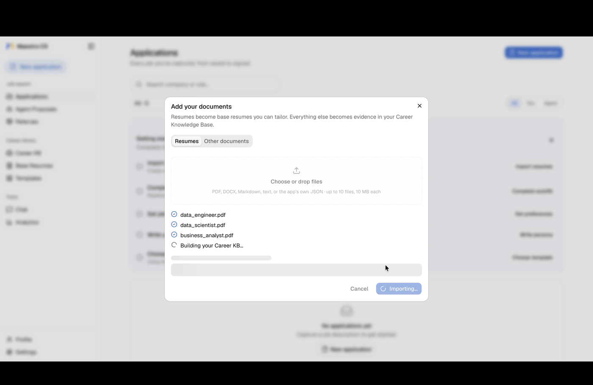

Drop **every** resume variant you have into the upload dialog — old ones,
role-specific ones, the too-long one. Maestro CS resolves duplicate entities
across them, clusters bullets, and builds one **Career Knowledge Base**: your
verified history in structured form.

This is the step that pays off repeatedly. Everything downstream composes from
approved KB points, so the KB's quality is the ceiling on everything else. Add
certifications, project write-ups and performance-review notes too — anything
true about your work is usable evidence later.

> **Review the KB inbox before tailoring.** Bullets that arrive unchanged from a
> file you wrote are approved on import; anything merged across resumes, or
> written by a model, waits in the review inbox for you. Only approved points
> compose into a resume, and duplicates across resume variants are common —
> fixing them once fixes every future application.

### 2. Build a base resume per career track

<!-- base-resume.png refreshed 2026-08-23 (post UI-clarity round). Contact
     header is the approved public set (sanitized +1-999-999-9999,
     ajey@seinun.com); "Liberty Hill, TX" experience location previously
     reviewed and accepted. 1400px wide to match the asset set. -->

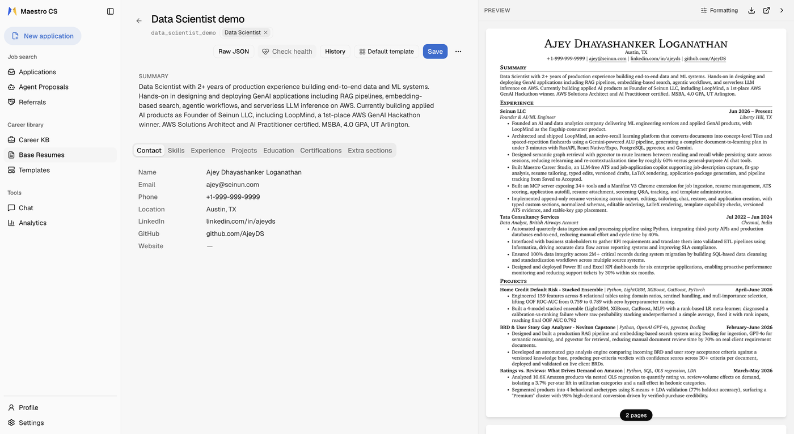

One base per track you actually target (e.g. *Data Scientist*, *ML Engineer*) —
not one per job. **New base resume → From Career KB** proposes which entries
belong, with a reason for each one it leaves off, plus a drafted summary.

<!-- kb-import.png captured 2026-08-23: the editor's Import from Career KB
     drawer; background contact panel deliberately blurred at capture time. -->

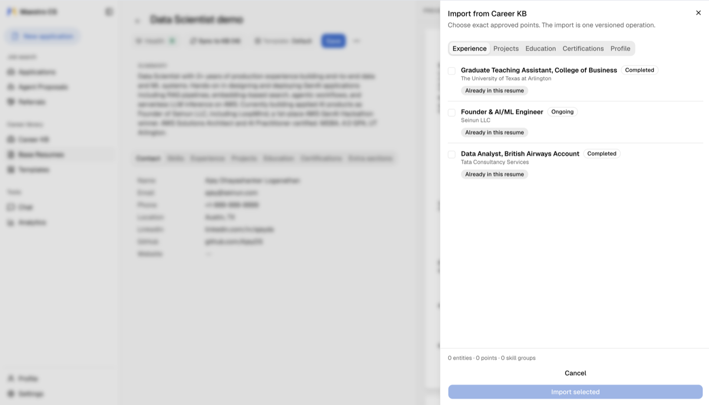

The optional instruction box steers *shape*, not facts: "lead with pipeline and
cloud work, keep it mid-level, leave off teaching." **Bullets are never
rewritten at this step** — approved KB points compose verbatim. That is
deliberate: it is what keeps a generated resume defensible.

### 3. Capture the job, then close the gaps

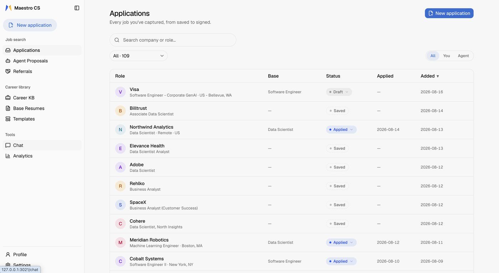

Paste the JD or capture it with the browser extension. Score it against your
bases — the ATS engine is deterministic and runs with **no LLM at all**, so the
same resume and JD always produce the same number and the same diagnostics.

<!-- job-overview.png captured 2026-08-23: real Lightning AI posting kept on
     the same precedent as the Visa posting (employer-published public
     document); the "your profile states 2" line matches the years already
     public in the shipped resume captures. -->

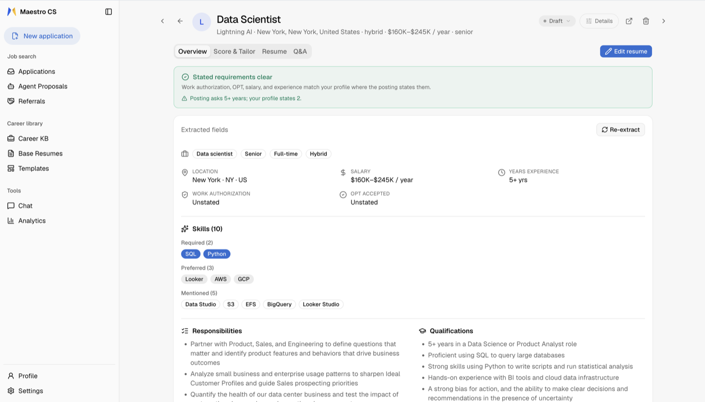

Every capture also gets a **knock-out pre-scan**: the posting's *stated*
requirements — work authorization, OPT policy, salary, years of experience —
checked against your profile before you spend any effort on it, with
mismatches said out loud rather than discovered at the screening call.

Then work the **gap workflow** rather than accepting a rewrite. It asks targeted
questions to surface things that are true but unwritten. Answers become new KB
evidence, so closing a gap once improves every future application.

> **A note on the score.** It is *our* score: deterministic, versioned and
> reproducible. It is **not** a prediction of what any real ATS shows you — no
> consumer tool can offer that, and independent tests keep proving the point:
> the same resume has scored [66–99 across 100 runs](https://danunparsed.com/p/hackerrank-open-source-ats)
> on a popular LLM-judged checker, and an
> [18-point spread](https://resumeoptimizerpro.com/blog/ats-resume-checker-tools-compared)
> across five commercial ones. Use ours to compare your own drafts against one
> another, and to catch parsing and coverage problems. Chasing 100 produces
> keyword-stuffed resumes that modern screens flag.
>
> **Language & script scope.** Maestro CS supports English-language resumes
> and job descriptions, with full support for accented Latin characters (such
> as *Zürich*, *José*, *Nestlé*, or *São Paulo*). Non-Latin scripts (such as
> CJK, Cyrillic, Arabic, Hebrew, Devanagari, or Thai) are not supported yet
> and are refused explicitly at ingest to prevent misleading, zero-coverage scores.

### 4. Generate the package, then read it

Cover letter, screening answers, and the rendered PDF. Read the output before it
goes anywhere — this is your name on it.

### 5. Choose your models deliberately

Three tiers are configured independently in **Settings → Models** — **Fast**
(extraction, classification, bulk KB work), **Smart** (tailoring, gap
enrichment, planning) and **Chat** (the interactive agent; needs **streaming
tool calls**). We benchmarked the combinations on real job postings, every
call traced, and the result was clearer than expected: **the Fast tier decides
almost everything** — how much of a posting's requirements get extracted, how
honest your base score is, and most of the wall-clock — while the Smart-tier
choice barely moved the outcome. So the decision collapses to two measured
setups, one per API key:

| | **OpenAI** · depth | **Gemini** · speed |
|---|---|---|
| Every tier set to | `gpt-5.6-luna` | `gemini-3.7-flash` |
| The one key you need | OpenAI | Gemini |
| JD requirements captured | the most complete extraction we measured | ~¾ of that, strongest on named tools |
| Capture + tailor feels like | ~40 seconds | ~10 seconds |
| Cost per application | **about a penny** | **under 3¢** *(Gemini promo pricing doubles Jan 2027)* |
| Hallucinated skills | zero measured | zero measured |

Neither is a tier above the other, and any OpenAI-compatible model can be
configured instead — these are simply the two we benchmarked, so you can start
from a known-good setup rather than guessing. A fresh install ships with the
OpenAI one already set, because honest scoring starts at extraction: a fast
model that misses requirements quietly *inflates* your fit score — in our tests,
by around nine points. Holding only a Gemini key, switch all three tiers in
**Settings → Models** (or set `FAST_MODEL`/`SMART_MODEL`/`CHAT_MODEL` in
`.env`). Press **Test** on any model to measure what it actually does. Mixing
tiers across providers is fully supported; in our tests it bought nothing that
one of these two doesn't already give you.

### Driving it from Claude, Codex, or ChatGPT (MCP)

Maestro CS ships an **MCP server** so you can run the whole pipeline
conversationally — extract a JD, score it, walk the gaps, render the PDF —
without leaving your assistant, whether that is Claude (Desktop or Code), the
ChatGPT desktop app, or the Codex CLI. Unlike SaaS-backed job-search MCP servers, it
runs on **your machine** against **your** database. Nothing is uploaded.

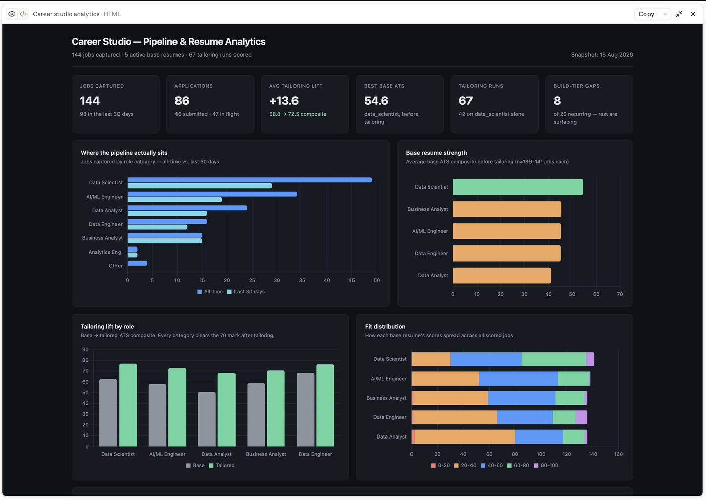

<!-- TODO(P4) mcp-chat.png — a SECOND shot for this section is still open: a
     Claude conversation answering a real question over the explore tools
     ("what keeps coming up in the jobs I'm saving that I'm not showing well?"
     -> surface vs build tiers). Two candidates exist and both need work: the
     gap-query capture reports `kb_points: 0` / "your Career KB is nearly
     empty", which argues against §1's own advice, and the base-resume-listing
     capture is one tool call ending on a question with no result. Re-capture
     against a scored instance, then save here and add below the dashboard. -->

With the backend already running, one command sets it up:

```bash
./scripts/setup-mcp.sh
```

That creates the host-side venv (the MCP server runs on your machine, so it
needs a host **Python 3.12+** — the script says exactly how to get one if
yours is older), installs the `mcp` extra, reads your backend port out of
`.env`, registers the server with **Claude Code** two ways — a repo-level
`.mcp.json` so any session opened in this repo offers it automatically, plus
a user-wide `claude mcp add` — and prints ready-to-paste blocks for **Claude
Desktop** and the **ChatGPT desktop app / Codex CLI** with every path already
filled in. Add `--profile hunt` to register a scoped profile instead, or
`--print-only` to change nothing and just see the config.

The script exists because MCP clients need an **absolute** path to the server
binary and GUI apps don't inherit your shell `PATH` — so the alternative is
hand-substituting four placeholders into a JSON file. Restart Claude Desktop
with Cmd+Q after pasting; a window close is not enough.

> **Or skip the copy-paste entirely.** Open a coding-agent session (Claude
> Code, Codex CLI) in this repo and ask it to run `./scripts/setup-mcp.sh` —
> the script knows it may be driven by an agent: it detects a nested Claude
> Code session, writes the repo-level `.mcp.json` instead of fighting the
> CLI, and prints the one command that still needs a plain terminal. If the
> agent's permission mode refuses to run the script, hand it
> `./scripts/setup-mcp.sh --print-only` output and let it apply the steps
> itself. Two checks before restarting anything: edits to Claude Desktop's
> config only survive if the app was **fully quit first** (it rewrites the
> file on exit), and the usual config mistake is a relative path or the
> container's `8000` where the host's `8001` belongs.

`BACKEND_URL` must be the **host** port compose publishes — `8001` by default,
not the container's internal `8000`. The script resolves this for you from
`BACKEND_HOST_PORT`.

Six profiles keep the tool list relevant per chat: `full` (83 tools), `hunt`,
`apply`, `explore`, `templates`, `career`. Enable one at a time — `full`
alongside a scoped profile registers each shared tool twice.

Doing it by hand instead:
[`backend/mcp_server/README.md`](backend/mcp_server/README.md) has the manual
steps and
[`claude_desktop_config.example.json`](backend/mcp_server/claude_desktop_config.example.json)
has every profile as a template. (ChatGPT on the *web* takes remote HTTPS
connectors only; the desktop app is the one that runs local servers.)

Whichever client you use, keep the transport **STDIO**. The HTTP option means
exposing a deliberately unauthenticated backend that holds your full employment
history — don't.

Full tool reference, profile table and troubleshooting:
[`backend/mcp_server/README.md`](backend/mcp_server/README.md).

---

## The rest of the toolkit

The workflow above is the spine. These are the parts that make each pass through
it cheaper than the last.

### Talk to one resume — or one section, or one bullet

The in-app chat is scoped by what you pin. Pin a base resume and it works on that
one; pin a section, an experience entry or a single bullet and edits outside that
scope are **refused**, not merely discouraged. Pin a KB entity — a project, a
role, a certification — to bring its detail into the conversation without letting
the chat rewrite it. Proposed edits arrive as an approval card you accept or
discard; nothing lands silently.

### No more `resume_v2_FINAL(3).docx`

Somewhere in that folder of copies is the old resume with the one great bullet
— and no way to tell which file it is. Here there is no folder of copies:
every write path — a manual edit, a chat edit, a tailoring run, even a restore
— records an append-only **resume version**. Open the version history on any
resume to diff two versions or restore one; nothing is ever lost, and nothing
is one-way. Old variants you no longer target aren't deleted either — they're
archived, still there when an unusual role calls for one.

### Tell it how you sound — once

A **persona** is durable context about you as a candidate: vision, strengths,
goals, working style, how your writing should read. Set it once in Profile
(or have it drafted from your Career KB, reviewed and saved by you) and every
generated document — tailoring, cover letters, screening answers — is written
in that voice, instead of you re-explaining it in every prompt. It shapes tone
and emphasis only; it is never a source of new factual claims.

### Health Report — is this resume sound at all?

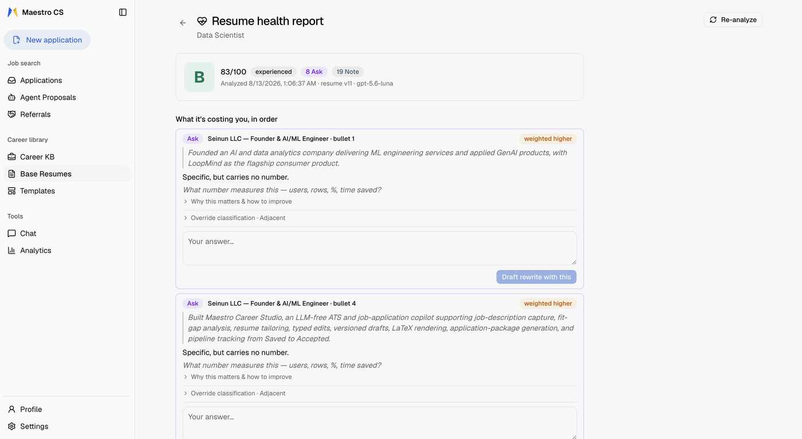

A gap needs a job. A **Health Report** does not: it is the deterministic,
job-independent check on one resume — parseability, dates, evidence quality,
format gates — and a failing fatal gate **blocks** tailoring outright, because
tailoring reorders an already-healthy document and cannot repair a broken one.
Run it per base resume, and overrule a finding deliberately (with a reason on the
record) if you disagree.

### Templates you actually own

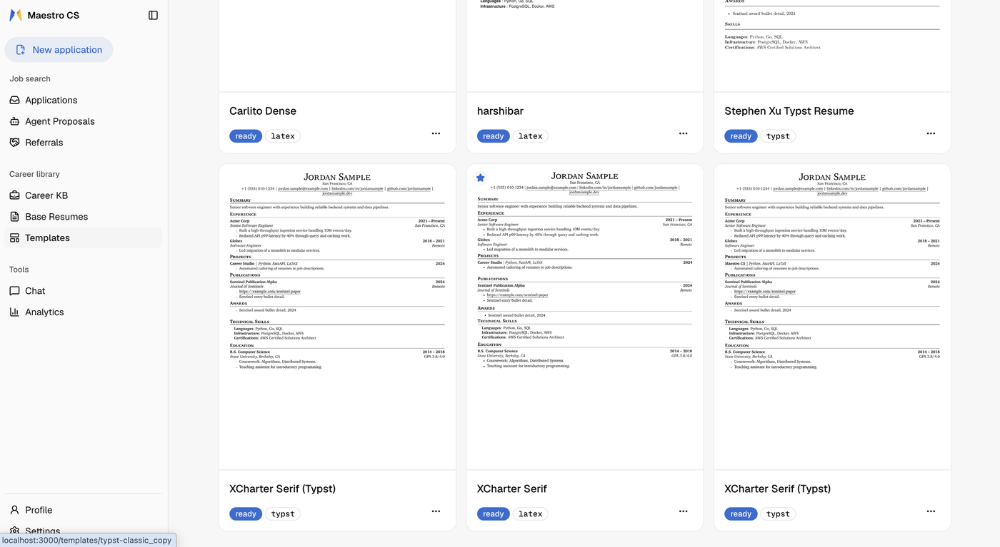

How many resume templates have you changed in your lifetime? For most people
the honest answer is one or two — because in a Word or hand-written LaTeX file,
a redesign means rebuilding the document. Here it stops being a life decision:
two engines, both compiled locally — **LaTeX** (pdflatex) and **Typst** — and a
template carries its own default formatting, layered under per-resume and
per-application overrides, so the same content renders through any of them
without being touched. Switching is a matter of taste and a button. Start from a bundled design, adapt one you liked
elsewhere, or write your own source in the built-in editor — validation compiles
a sample PDF and runs the same parse-certification gate either way, so a template
that would break an ATS parser never reaches `ready`. *(The web "New template"
flow starts from a LaTeX starter today; Typst templates are created through the
API or MCP.)*

### Quick Tailor, when you already know the answer

The guided gap workflow is the careful path. **Quick Tailor** is the other one:
one request against a job, resolutions planned from your saved preferences,
tailored and rendered without opening a tailoring session at all. The honesty
rule survives it — a keyword the engine found no evidence for can still only land
in your skills list, never as an invented experience bullet.

### The browser extension

<!-- P4 extension.gif — CLEARED for publish 2026-08-20. Contact header scrubbed;
     the Job/Score/Resume/Fill/Track ladder and the multi-base scoring panel
     ("4 base resumes scored against this JD") are the feature moments. The Fill
     step is never executed in this take, so NO autofill values are ever on
     screen — preserve that if re-recording. Real employer careers page and the
     "Liberty Hill, TX" experience location reviewed and accepted by the owner.
     1000px / 10fps / 64 colors, 2.6 MB; re-encode any replacement to match. -->

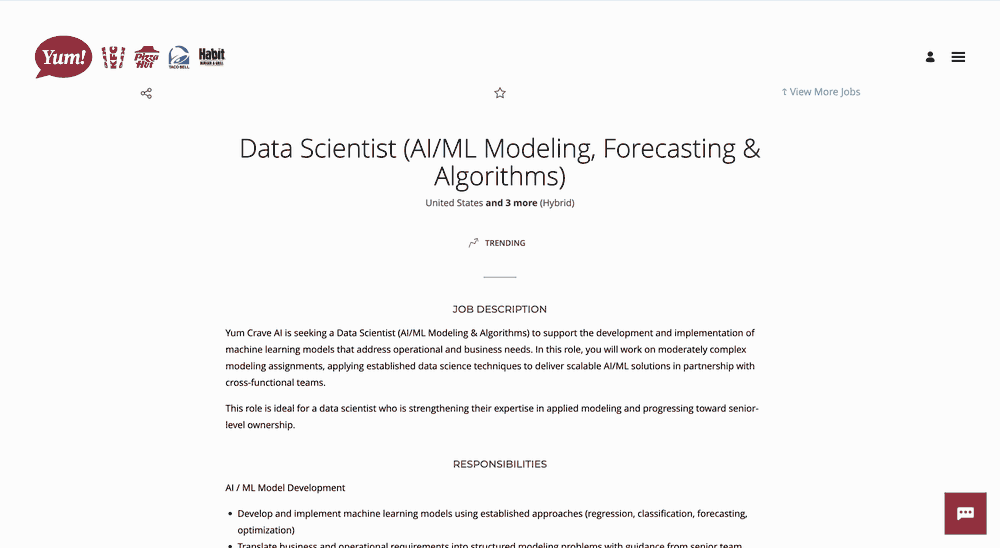

A browser side panel: capture a posting from the board you are already
reading, and fill application forms from your **Autofill Profile**. Its telemetry
records *which* fields it met and whether they filled — label, kind, rule,
outcome, host — and structurally cannot store a value you typed: the models have
no value column.

The other half of that sentence is worth saying out loud, because "no values" is
not the same as "nothing personal". Each row keeps the **hostname** and a
first-seen timestamp, so what the table accumulates is a record of *which
companies you applied to, and when*. Three things bound it: it never leaves your
machine (the extension posts to your own backend on `localhost` — there is no
collector at the other end, in this repo or anywhere else), capture is a toggle
in the widget's `⋯` menu, and **Analytics → Autofill coverage → Clear data**
deletes all of it, whenever you want, without turning capture off.

Signatures, attestations, consent checkboxes, credentials and
government IDs sit on a deny-list that both write paths consult, so they are
never filled and never shown to a model. Those stay human-only, always.

### Analytics: what the market keeps asking you for

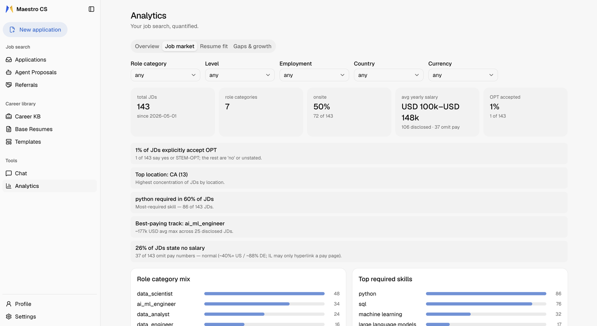

Every captured job builds a picture of the market you are actually applying into
— top skills, a skill heatmap, role mix over time — filterable by role category,
seniority level and employment type. The one that pays is **Gaps & growth**: gap
frequency re-keyed to the engine's canonical skill form and classified against
your Career KB as *missing*, *already in your KB* or *already on a resume*.
Frequent and missing is the next thing worth learning; frequent and already in
your KB is something you have and keep forgetting to say. **Resume fit** shows
the measured base → tailored lift per base resume, so you can see whether
tailoring is doing anything at all for you.

### Hunt with the agent you already use

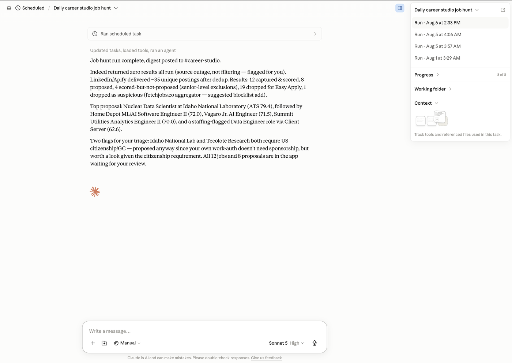

The MCP server is more than a remote control. `get_job_search_brief` hands an
agent a composed brief — your stated preferences, your work-authorization answers
verbatim, and the guardrails you configured — so a Claude or Codex session can go
find postings on whatever boards it can read, capture them, score them against
your bases and hand back a ranked shortlist. There is no board integration to be
locked into and no scraper to break: the agent reads what you would have read.

My own daily prompts — a scheduled hunt and two apply-session
variants, with the personal parts turned into placeholders — are in
[`docs/agent-prompts/`](docs/agent-prompts/) as starting points to adapt.

### Going all the way: the proposal ledger

<!-- TODO(P4) proposals.png — the /proposals view: the Captured/Proposed/
     Accepted/Approved/Submitted counters, the daily cap chip, and the queued
     proposals with their ATS scores. It shows this section's core claim -- the
     lane stops before submitting -- in the app's own words ("What the hunt
     found. Submitting still needs your approval."). Captured but not yet saved
     to a file; drop it at docs/assets/proposals.png and uncomment: -->
<!--  -->

Maestro CS can carry an application to the point of submission. This is the
part to read rather than skim.

A hunted job becomes an **application proposal** in a staged lane: tailored,
rendered and filled without interrupting you at every page — and then it stops.
You triage proposals on `/proposals` (accept or decline, in bulk if you want),
and **apply runs execute only proposals you accepted**. Nothing is ever executed
*from* the web app: filling and submitting happen only inside a live agent
session holding a browser, and the final consent lives in that same session, one
turn before the click — recorded as an append-only consent event and metered by a
daily cap you set.

Be clear-eyed about what that consent event is: the agent writes it when it
calls the tool, so it records *that the agent said you agreed*. It gives you
attribution after the fact and a hard ceiling on volume; it is not a lock a
prompt-injected agent cannot pick. The lane is built to be run while you watch
it. An agent can
never self-certify: marking a proposal submitted needs a receipt or your own
explicit attestation, and a submit click that cannot be verified ends terminally
as `submission_uncertain` — never retried, never re-clicked.

**The risks, plainly.** Letting an agent read job pages and drive a browser for
you means three real exposures:

- **Prompt injection.** A job posting is untrusted text. Text inside one can try
  to instruct the agent reading it.
- **Unverified employers.** A hunted posting is not a vetted one, and an
  application carries your contact details and work history to whoever posted it.
- **Bot detection.** Some employers filter applications that look automated, and
  we will not help you hide — no stealth automation, no CAPTCHA bypass, no
  headless submitting. See [Project Scope](CONTRIBUTING.md#2-project-scope).

The consent gate exists because those risks are real and unfixable, not because
they are hypothetical. Use the lane on jobs you have looked at yourself.
Everything it does is written down — proposals, consent events, and the evidence
files behind them.

### Leave with everything

`career.md` is your whole career record as one deterministic Markdown file — no
model involved — downloadable from the Career KB page or over MCP. Tailored
output is filed the same way: every application render lands in
`applications/` in its own company-and-role-named folder holding the typeset
source and the exact PDF, so going back to verify what you actually sent is
opening a folder, not querying a database. The database is yours, the resumes
are files on your disk, and nothing about leaving is engineered to be
difficult, because nothing here was ever monetized by making it so.

---

## Execution Modes & Docker Compose Stack

### 🚀 Production Mode (Default & Fast)
```bash
docker compose up --build
```
By default, `docker-compose.yml` deploys an optimized production build of the Next.js frontend (`npm start`) and standalone Uvicorn server. In this mode, page shell serving latencies drop from dev-time lags down to **1–2 milliseconds**, providing an instantaneous UX.

### 🛠️ Development Mode (Hot Reload)
```bash
docker compose -f docker-compose.yml -f docker-compose.dev.yml up --build
```
To avoid imposing development compilation latency (which can run up to ~1600ms on cold routes) on everyday usage, dev-mode bind mounts and live reload servers are isolated in `docker-compose.dev.yml`. Including this file bind-mounts your local `backend/app` (`uvicorn --reload`) and `frontend/` (`npm run dev`) for instantaneous code iteration.

### 📊 LLM Tracing (Langfuse, Optional)

Every LLM invocation — prompt, latency, token count, and a feature tag for Q&A,
JD extraction and tailoring — can be sent to a [Langfuse](https://langfuse.com)
instance **you** already run, self-hosted or Cloud. All three variables are
required, and — deliberately — **the compose stack does not forward them**:
traces contain your prompts, i.e. your resume text, and a stale key pair
passed through silently would ship that to a third party. To trace, run the
backend process yourself (outside compose) with:

```bash
LANGFUSE_PUBLIC_KEY=pk-lf-...
LANGFUSE_SECRET_KEY=sk-lf-...
LANGFUSE_HOST=https://your-langfuse-host
```

Tracing is off whenever any of the three is unset, and the app never requires
it. Point it at a host you control.

> We deliberately do **not** ship a Langfuse stack in this repo. Bundling one
> meant shipping a compose file with fixed default secrets (session-signing keys
> published in a public repository are forgeable), for a component most users
> never enable. Running your own is a documented, one-command Langfuse install
> and keeps its secrets yours.

---

## Project & Runtime Directory Layout

- `backend/` — FastAPI application, business logic, deterministic ATS engine, database models, and dual-engine PDF renderers (typst + LaTeX).
- `frontend/` — Next.js 16 (App Router) modern reactive interface with Base UI / Tailwind styling.
- `extension/` — Companion Chrome extension: a side panel for one-click JD ingestion from job boards and automated form filling. See [`extension/README.md`](extension/README.md).
- `settings/` — local profile, persona, memory, and autofill runtime state, including `autofill.json`; ignored except for `.gitkeep`, and personal data must never be committed.
- `base_resumes/` — local runtime repository for base resume JSON payloads and rendered tex/pdf output; ignored except for `.gitkeep` and exactly one synthetic `example.json` shipped as the demo seed. Personal resumes must never be committed.
- `kb_documents/` — local runtime data directory for supporting knowledge base files and docs; ignored except for `.gitkeep`, and personal documents must never be committed.
- `exports/` — derived, downloadable personal artifacts such as `career.md`; ignored except for `.gitkeep` and mounted into the backend container.
- `applications/` — Rendered per-application artifacts organized by company and role (tex, typ, pdf).
- `logs/` — Application runtime execution logs.
- `docker-compose.yml` — Core production architecture (postgres, backend, frontend).
- `docker-compose.dev.yml` — Development overrides for bind mounts and hot real-time reload.

---

## Community, Documentation & Contributing

**Contribution fast-path:** docs fixes, resume/cover-letter templates and
extension job-board adapters go straight to PR — no issue needed. Features and
architecture changes: open an issue first. Every PR gets a human first
response within 48 hours, and every PR is read by a human — we don't merge
AI slop.

This is an early release. If something doesn't work, please say so — a clear
bug report is a contribution, and one of the most valuable kinds right now.

- **Project site:** [maestrocareerstudio.com](https://maestrocareerstudio.com) — the tour in five minutes: what it does, what it costs to run, and how the pieces fit, before you clone anything.
- **Getting Started guide:** [`docs/GETTING_STARTED.md`](docs/GETTING_STARTED.md) — installation to first tailored PDF, step by step, plus the in-app tour and the agent-assisted setup path.
- **Known Issues & Where Help Is Wanted:** [`KNOWN_ISSUES.md`](KNOWN_ISSUES.md) — **Start here.** What is solid, what is rough, what is a deliberate limitation rather than a bug, and the specific gaps worth picking up. This project is early and that file says so plainly.
- **Architecture Source of Truth:** [`SYSTEM.md`](SYSTEM.md) — The living reference for how the system fits together, at the repo root so every agent tool finds it. It holds the orientation tier — layout, architecture, invariants, environment, workflow, and the three ledgers — and indexes the reference tier it delegates to: per-entity lifecycles in [`docs/entities/`](docs/entities/) and UI rules in [`docs/frontend-conventions.md`](docs/frontend-conventions.md). Meant to be searched rather than read front to back; the code cites its section numbers and invariant ids directly. Read the relevant part before altering behaviour.
- **Domain Glossary:** [`UBIQUITOUS_LANGUAGE.md`](UBIQUITOUS_LANGUAGE.md) — The vocabulary of the domain, and the words to avoid. Worth ten minutes before your first issue or PR.
- **Contributing Guide:** [`CONTRIBUTING.md`](CONTRIBUTING.md) — Learn how to run automated unit tests, set up dev virtual environments, and file deprecation rows.
- **Security & Privacy Policy:** [`SECURITY.md`](SECURITY.md) — Understand localhost network guidelines and vulnerability reporting protocols.
- **Open Source License:** [`LICENSE`](LICENSE) — Apache License 2.0, plus [`NOTICE`](NOTICE).

---

## Licensing

Maestro CS is free software under the **[Apache License 2.0](LICENSE)**.

**You may use this commercially, and you do not have to publish your changes.**
Fork it, embed it in a product, run a modified copy as a hosted service, ship it
inside something closed — all permitted. Apache 2.0 asks three things in return:
keep the license and copyright notices, state what you changed in the files you
changed, and pass along the [`NOTICE`](NOTICE) file with any redistribution.
It also carries an **explicit patent grant** from every contributor, which is
the main practical reason to prefer it over MIT or BSD.

Attribution for the third-party pieces we redistribute — the LaTeX resume
template, the XCharter font, the embedding model — is in
[`THIRD_PARTY_NOTICES.md`](THIRD_PARTY_NOTICES.md), and that file is part of
what the license asks you to carry forward.

**No CLA.** Contributions are licensed to the project under Apache 2.0 by
[section 5](LICENSE) of the license itself, which is all this project needs.
There is nothing to sign. Commercial questions: **ajey@seinun.com**.

---

## Credits & Citation

Maestro CS stands on other people's work. The full inventory — bundled
sources, the embedding model, the document toolchain, and every runtime
dependency with its license — is in
[`THIRD_PARTY_NOTICES.md`](THIRD_PARTY_NOTICES.md). The ones that shape the
product most:

- **[Jake's Resume](https://github.com/jakegut/resume)** by Jake Gutierrez (MIT)
  — the LaTeX resume and cover-letter templates are adapted from it, including
  the `glyphtounicode` ATS-parseability approach.
- **[BAAI/bge-small-en-v1.5](https://huggingface.co/BAAI/bge-small-en-v1.5)**
  (MIT) — the pinned embedding model behind the ATS engine's semantic layer,
  running locally on CPU. Please cite
  [C-Pack (arXiv:2309.07597)](https://arxiv.org/abs/2309.07597) if you build on
  the scoring engine.
- **[TeX Live](https://tug.org/texlive/)** and
  **[Typst](https://github.com/typst/typst)** — the two render engines, with
  XCharter and FontAwesome 5 for type and icons.
- **[Next.js](https://nextjs.org)**, **[React](https://react.dev)**,
  **[Tailwind CSS](https://tailwindcss.com)**, **[Base UI](https://base-ui.com)**,
  **[shadcn/ui](https://ui.shadcn.com)**, **[Monaco Editor](https://github.com/microsoft/monaco-editor)**,
  **[FastAPI](https://fastapi.tiangolo.com)**, **[SQLAlchemy](https://www.sqlalchemy.org)**,
  and **[fastembed](https://github.com/qdrant/fastembed)** carry the rest.

If you use Maestro CS in published work, cite it via
[`CITATION.cff`](CITATION.cff) — GitHub turns that file into a **"Cite this
repository"** button with ready-made APA and BibTeX. Or take the BibTeX
directly:

```bibtex
@software{maestro_career_studio,
  author   = {Loganathan, Ajey Dhayashanker},
  title    = {Maestro Career Studio: a local-first, evidence-backed
              job-application copilot},
  url      = {https://github.com/seinun-ai/maestro-career-studio},
  license  = {Apache-2.0},
  year     = {2026}
}
```

---

## Troubleshooting & Common Questions

**`pdflatex` or `typst` compilation failures on boot:**
Render exceptions during initial seeding are safely caught and logged; database records are still minted even if PDF rendering hits a local font or dependency missing in custom setups. Re-attempt rendering directly from the UI once the backend container initializes.

**"port is already allocated" on `docker compose up`:**
All three host ports are overridable in `.env` — `BACKEND_HOST_PORT` (8001), `FRONTEND_HOST_PORT` (3000) and `POSTGRES_HOST_PORT` (55432). Find the culprit with `lsof -i :<port>`, change the number, and run `docker compose up -d` again. Only the host side of the mapping moves; the containers keep their internal ports, so nothing else needs editing — except the browser extension's backend/app URLs, which you set under `⋯` on its card. Two of the defaults are already chosen to dodge the usual collisions: 8001 rather than 8000 (uvicorn, Django and `python -m http.server` all default to 8000) and 55432 rather than 5432 (any locally installed PostgreSQL).

**Postgres data looks wrong, or an aborted build corrupted it:**
`docker compose down -v` resets the data volumes. **This deletes every application, resume version and KB entry in that stack** — export anything you want to keep first.

**LLM calls returning 401 Unauthorized or Quota errors:**
The backend imports `OPENAI_API_KEY` and `GEMINI_API_KEY` at process initialization. If you modify `.env` after containers start, run `docker compose restart backend`. Settings status indicators confirm real-time detection of configured keys.

**Frontend reporting API connection errors outside Compose:**
In standard Docker usage, internal frontend requests route over the private bridge network (`http://backend:8000`). If testing `npm run dev` natively on your host machine, export `NEXT_PUBLIC_API_URL=http://127.0.0.1:8001` or rely on defaults in `frontend/lib/api.ts`.
